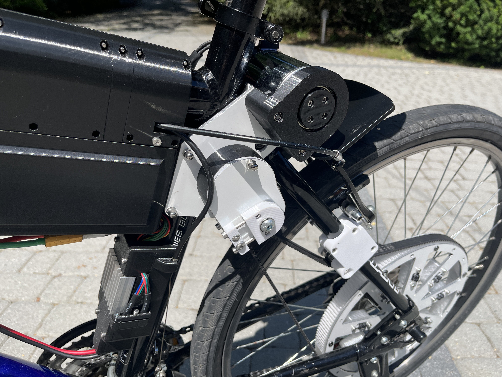
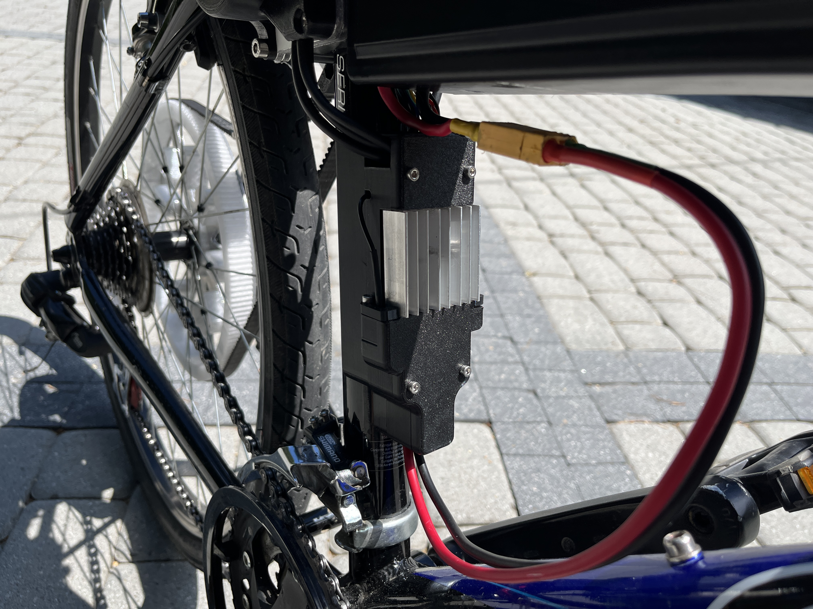

## Used Technologies
- CNC milled aluminium plates + 3D printed parts for mounting gear
- 149KV BLDC motor controlled with FOC
- VESC controller
- 8S 16AH LiPo battery
- Arduino pro micro for throttle control
- ESP32 S3 mini for OLED display control

## Features
- ~35km full electric range on max speed
- 38.5km/h max speed
- 20 deg. full current climb
- full can bus between ESP32 and VESC controller

